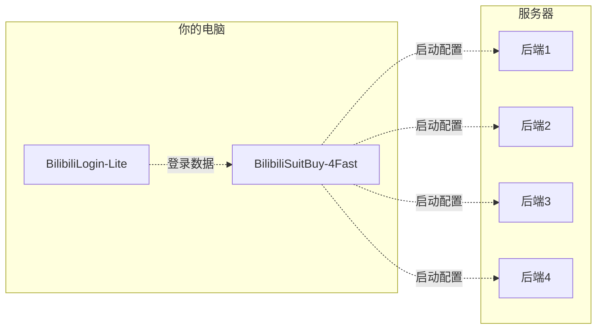

# BilibiliSuitBuy-4Fast [b站装扮购买(快速模式)]

**一个简单的抢装扮脚本的启动设置预处理器, 搭配C语言后端使用**

## 支持

- [x] 图形用户界面
- [x] 自定义启动时间
- [x] 自定义购买数量
- [x] 可用优惠劵搜索
- [x] 装扮标识搜索
- [x] [短信登陆](https://github.com/FangCunWuChang/BilibiliLogin-Lite)
- [x] [账密登陆](https://github.com/FangCunWuChang/BilibiliLogin-Lite)

## 运行依赖

Python3.10.7及更高版本  
httpx包

## 如何设置

**设备信息可以在 安卓APP-设置-关于哔哩哔哩-网络诊断 获取**  
<small>网络诊断结果里Model, Android Build Version, VersionCode, VersionName, Buvid就是</small>

**基础信息基本不需要管**
<small>渠道, 购买时长这些</small>

**也没什么说的, 装扮标识和优惠凭证都可以用右边的搜索搜索出来**
<small>双击选择</small>

**启用时间单位是秒的时间戳, 时间戳转换进[这里](https://developer.aliyun.com/skills/timestamp.html)**
<small>单位秒! 单位秒! 单位秒!</small>

**导入登陆请搭配[BilibiliLogin-Lite](https://github.com/FangCunWuChang/BilibiliLogin-Lite)使用**
<small>这里不提供教程</small>

## 工具链
### 工作流程


### 相关工具
- 前端  
  [BilibiliLogin-Lite](https://github.com/FangCunWuChang/BilibiliLogin-Lite) B站账号登录工具  
  [BilibiliSuitBuy-4Fast](https://github.com/FangCunWuChang/BilibiliSuitBuy-4Fast) B站装扮购买配置生成工具  

- 后端  
  [bilisuit-go](https://github.com/FangCunWuChang/bilisuit-go) B站装扮购买后端Golang版本  
  [bilisuit-fast](https://github.com/FangCunWuChang/bilisuit-fast) B站装扮购买后端C版本

## 其他

要用先进行"整点测试", 先不充钱找个整点开售的装扮试试。下不了单你号就是寄了。

**导入登陆文件内容格式(json)**
```json
{"cookie": "k1=v1; k2=v2", "accessKey": "xxxxxxxxxxx"}
```

## 参考

[github.com/python-hyper/h2](https://github.com/python-hyper/h2)

[plain-sockets-example.html](https://python-hyper.org/projects/h2/en/stable/plain-sockets-example.html)
