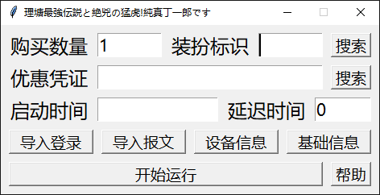
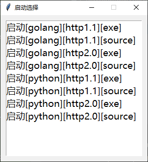

# BilibiliSuitBuy [b站装扮购买]

**一个简单的抢装扮脚本**

---

### 支持

- [x] 图形用户界面
- [x] 自定义启动时间
- [x] 自定义购买数量
- [x] 可用优惠劵搜索
- [x] 装扮标识搜索
- [x] 抓包数据导入
- [x] [短信登陆](https://github.com/lllk140/BilibiliLogin)
- [x] [账密登陆](https://github.com/lllk140/BilibiliLogin)
- [x] **HTTP1.1**
- [x] **HTTP2.0**

---

### 运行

**安装 [Python3.10.7](https://www.python.org/downloads/)**(<small>安装时只要勾上<code>add path</code>就行</small>)

**安装 [Go1.19.4](https://golang.google.cn/dl/)**

**1.克隆项目**(<small>当然你也可以直接下载解压</small>)
```shell
git clone https://github.com/lllk140/BilibiliSuitBuy.git
```

**2.进入项目目录**
```shell
cd BilibiliSuitBuy
```

**3.运行bat脚本**
```shell
install-http.bat
install-app.bat

# 当然也可以双击运行
# 执行完后直接双击main.exe运行
```

---

### 运行1【如何设置】:

<div align=center></div>

**先填写设备信息再继续, 不会获取的看[BV1aD4y147pX](https://www.bilibili.com/video/BV1aD4y147pX)开头到30秒**
<small>别问什么不一样, 这是简化过的</small>

**基础信息基本不需要管**
<small>渠道, 购买时长这些</small>

**也没什么说的, 装扮标识和优惠凭证都可以用右边的搜索搜索出来**
<small>双击选择</small>

**启用时间单位是秒的时间戳, 时间戳转换进[这里](https://developer.aliyun.com/skills/timestamp.html)**
<small>单位秒! 单位秒! 单位秒!</small>

**导入登陆请搭配[BilibiliLogin](https://github.com/lllk140/BilibiliLogin)使用**
<small>这里不提供教程</small>

**解析报文一般用不到, 这个可以直接把信息填全**
<small>底下是教程</small>
<details>
<summary>这里是教程</summary>

<small>[fiddler抓https教程](https://www.bilibili.com/video/BV1Re411g7f5)</small>

<small>1.启动fiddler, 装扮商店随便找个装扮点进去</small>

<small>2.然后fiddler里搜索```ctrl+f``` ```/x/garb/v2/mall/suit/detail```</small>

<small>3.选中后点击请求报文的```Raw```, 全选```ctrl+a```复制```ctrl+c```下来</small>

<small>4.新建个空白文本文件粘贴```ctrl+v```进去并保存, 选择保存的文件就行</small>
</details>

### 运行2【脚本本体的选择】:

<div align=center></div>

格式: ```启动[语言][协议][类型]```

| 语言     | 协议      | 类型   | 速度  | 计时器 |
|--------|---------|------|-----|-----|
| Python | HTTP1.1 | 运行程序 | 中   | 单线程 |
| Python | HTTP1.1 | 源代码  | 中   | 单线程 |
| Python | HTTP2.0 | 运行程序 | 慢   | 单线程 |
| Python | HTTP2.0 | 源代码  | 慢   | 单线程 |
| Golang | HTTP1.1 | 运行程序 | 快   | 多线程 |
| Golang | HTTP1.1 | 源代码  | 快   | 多线程 |
| Golang | HTTP2.0 | 运行程序 | 中   | 多线程 |
| Golang | HTTP2.0 | 源代码  | 中   | 多线程 |

### 其他:

要用先进行"整点测试", 不知道是啥就去话题问

**导入登陆文件内容格式(json)**
```json
{"cookie": "k1=v1; k2=v2", "accessKey": "xxxxxxxxxxx"}
```

---

<div align=center><h4>v我2.5%👾</h4></div>

<div align=center></div>

---

### 参考:

[github.com/python-hyper/h2](https://github.com/python-hyper/h2)

[plain-sockets-example.html](https://python-hyper.org/projects/h2/en/stable/plain-sockets-example.html)

---

还是那句话:

<details>
<summary>👀</summary>

<h1>你问我为什么不开，我没钱，我没账号，我没设备，我没渠道，我啥都没有，我开个✓8</h1>

</details>
